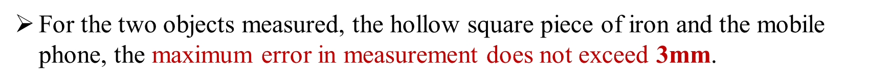
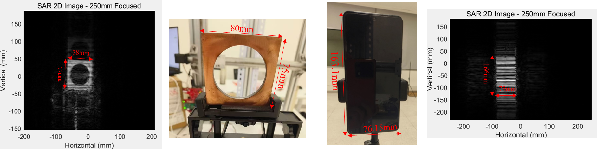
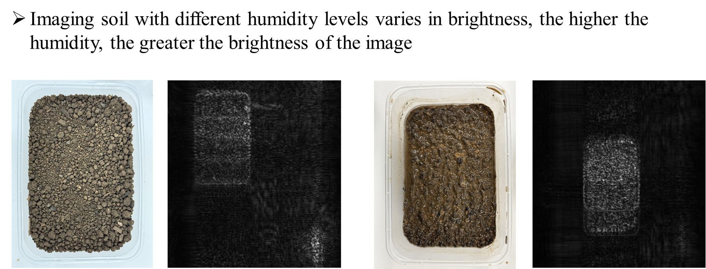
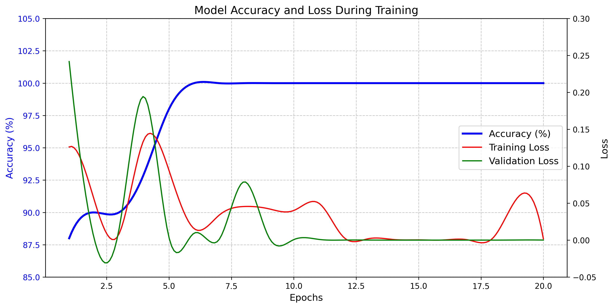

# MIMO-SAR Based Soil Wetness Detection

### **Imaging Result**







### **Hardware:**

- Driver: **DM542S**
- Motor : **42 BYG H4812 Motor**
- Microcontroller: **Ardiuno Mega**
- mmWave Radar: **AWR1843 Boost**
- **400 $\times$ 400 2D Scanner**
- **4mm pitch of thread and 9mm diameter**

### **Software:**

- mmWave Studio
- Ardiuno IDE
- Matlab
- Python

### **MIMO-SAR-mmWave-Imaging-Toolbox**

In this repository, we leverage and modify  a comprehensive open-source MIMO-SAR imaging toolbox, which is a MATLAB based software package.

Citation: Yanik, Muhammet Emin, et al. “Development and Demonstration of MIMO-SAR MmWave Imaging Testbeds.” IEEE Access, vol. 8, Institute of Electrical and Electronics Engineers (IEEE), 2020, pp. 126019–38, doi:10.1109/access.2020.3007877.

Our code consists of three main modules: (1) data capture, (2) MIMO array calibration, and (3) image reconstruction. The framework of each module is detailed in our journal paper.

### **How to Use**

#### Data Collection or Data Access

You can build up one platform leveraging all the hardware components mentioned above and collect your own MIMO-SAR data, which may be quite challenging and exhausting.

Therefore, we provide you with the following data to make you have a general idea about what the imaging is like.

You can access these data shared by Baidu Disk ：MIMO-SAR Data  through the following link. 

- Link: https://pan.baidu.com/s/1aAp8LxT2ngH5ruKbu5GJuw?pwd=3ww1 

- Password: 3ww1

#### Modify all Necessary directories and files

Put all the data you collect or download into the file path ' .\Data\valid' 

```matlab
%--------------------------------------------------------------------------
% Path for the adcBinData
experiment_folderName = '.\Data';
adcBinData_subFolderName = 'valid';

% Path for the Calibration Data 
calData_fileName = '.\Algorithms\calibration\calData\calData_3Tx_4Rx.mat';
delayOffset_fileName = '.\Algorithms\calibration\calData\delayOffset_3Tx_4Rx.mat';

%Here we can also add path for background calibration 
```

#### Mean Target z-Distance and Other Modified Parameters

```matlab
zTarget_mm = 250; % update the distance as needed.

sensorParams.Num_Frames = 400;

sarParams.Num_verticalScan = 50 %Update these two parameters as well
```

#### Choose the data you read

Open the file  .\Algorithms\dataRead\fcn_read_ADC_bin_SAR.m

Change the adc_file_name to the name of your data

```matlab
function [rawData_Rxchain]= fcn_read_ADC_bin_SAR(sensorParams,sarParams,adcBinData_folderName)

Num_RX_channels = 4; % Fixed for this version

Samples_per_Chirp = sensorParams.Samples_per_Chirp;

Chirps_per_Frame = sensorParams.Chirps_per_Frame;

Num_TX = sensorParams.Num_TX;

Num_Frames = sensorParams.Num_Frames;

Num_measurements = sarParams.Num_horizontalScan * sarParams.Num_verticalScan;

% adc_file_name = [adcBinData_folderName '\ADC Temp.bin'];

% adc_file_name = [adcBinData_folderName '\sar_data_con_3_Raw_0.bin'];

adc_file_name = [adcBinData_folderName '\dry.bin'];

% [ErrStatus,rawData] = Parse_Datafile_bin_SAR(adc_file_name,2*Num_RX_channels,Samples_per_Chirp,Chirps_per_Frame*Num_TX,Num_Frames,Num_measurements);

% if ErrStatus~=0

%     disp('Error in parsing data file for Rxchain');

%     return

% end

rawData = read1843Data(adc_file_name,256,4);

% //I+Q:2-> complex

% 

% rawData = reshape(rawData,2*Num_RX_channels,[]);

% 

% rawData1 = rawData(1,:) + 1i*rawData(3,:);

% rawData2 = rawData(2,:) + 1i*rawData(4,:);

% rawData3 = rawData(5,:) + 1i*rawData(7,:);

% rawData4 = rawData(6,:) + 1i*rawData(8,:);

% rawData_Rxchain = [rawData1;rawData2;rawData3;rawData4];

% rawData_Rxchain = rawData([1,3,5,7],:) + 1i*rawData([2,4,6,8],:);

% reshape the rawData_Rxchain

rawData_Rxchain = reshape(rawData,Num_RX_channels,Samples_per_Chirp,Num_TX,Chirps_per_Frame,Num_Frames,Num_measurements);

% reshape the rawData_Rxchain as Num_RX_channels x Num_TX x Samples_per_Chirp x Chirps_per_Frame x Num_Frames x Num_measurements

rawData_Rxchain = permute(rawData_Rxchain,[1,3,2,4,5,6]);
```

#### Run the workflow

After modify the directories, files and parameters,  running the workflow is what you need !

#### Training and testing

You are supposed to start training only if you arrange your data well. A brief structure is as follows.

```
data/
├── train/
│   ├── class1/
│   │   ├── image1.jpg
│   │   ├── image2.jpg
│   │   └── ...
│   ├── class2/
│   └── ...
└── val/
    ├── class1/
    │   ├── image1.jpg
    │   ├── image2.jpg
    │   └── ...
    ├── class2/
    └── ...
```

Here, `class1`, `class2` and etc. are regarded as labels of each class.

Then, run the following line in your **command** to install necessary dependencies if you have not.

```
pip install torch torchvision tqdm
```

And run the script `train.py` to start. GPU is supported and highly recommended for efficient training.

```
python train.py
```

Finally, after getting your model `[name].pth`, just modify the dict `CIFAR10_CLASSES` to match the class No. and the label, and set `num_classes` correctly. Run the last line after you name the target file `test_img/tst_image.png` and you will get your result.

```
python predict.py
```


